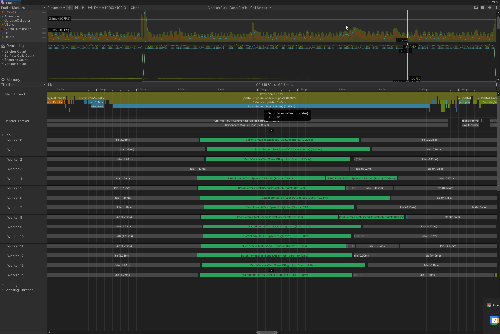
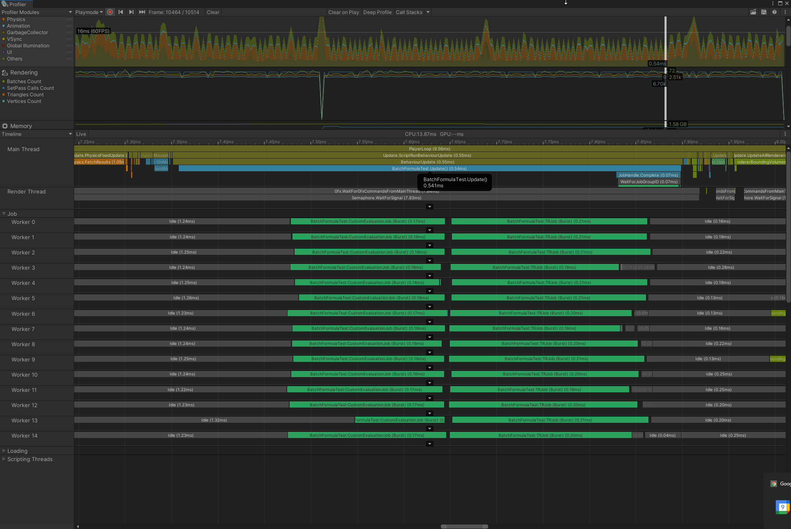

# BurstExpressions

An optimizing  expression parser with an efficient Burst-compiled evaluation engine and live-edit in editor (soon, optionally in the runtime too).

When declaring a formula, you can specify the parameters it will receive from the code, like the current time `t`.

Any value that is not a parameter will be considered as a *named value*. A named value can be a single `float` or `float3` or a nested formula that can use the same parameters and named values and declare new named values.

Evaluation can happen from the main thread or from jobs, and an expression can be evaluated multiple times with different parameters in batch.

## How it works

The parser (a standard [Shunting-Yard](https://en.wikipedia.org/wiki/Shunting-yard_algorithm) algorithm) creates an AST, which is then transformed to [Reverse Polish Notation](https://en.wikipedia.org/wiki/Reverse_Polish_notation). The RPN is stored as an array and evaluated using a simple [Stack machine](https://en.wikipedia.org/wiki/Stack_machine).

The RPN expression is optionally optimized using [Constant Folding](https://en.wikipedia.org/wiki/Constant_folding), which means that an expression like `2+3*4` will result in a constant `14`.

## Getting started

```csharp
using Eval;
using Eval.Runtime;
using Unity.Mathematics;
using UnityEngine;

public class FormulaTest : MonoBehaviour
{
    // The formula itself
    public Formula Test;
    private EvaluationGraph _evalgraph;

    public void Reset()
    {
        if (Test == null) Test = new Formula();
        Test.SetParameters("t", "pos");
    }

    // compile the formula once
    private void Start() => Test.Compile(out _evalgraph);

    private void OnDestroy() => _evalgraph.Dispose();

    private void Update()
    {
        // this call is editor only and will get stripped in a build
        Test.LiveEdit(ref _evalgraph);

        // parameters can be provided as a single float3 if you only need one, a NativeArray<float3>
        // or a float3*. If you use a pointer and have already allowed unsafe, using a stackalloc float3[2]
        // can be practical
        var parameters = new float3[2];
        parameters[0] = Time.realtimeSinceStartup;
        parameters[1] = transform.localPosition;
        
        float3 res = float3.zero;
        EvalState.Run(_evalgraph, parameters, out res);

        transform.localPosition = res;
    }
}
```

For a more advanced use case, see `BatchFormulaTest`, which runs the evaluation in a burst compiled job, batched, and does not allocate.

## Performance

The sample scene in `BatchTest` uses a MonoBehaviour called `BatchFormulaTest`, which sets the position of 10 000 cubes with the following formula: `v3(i, sin(t*14 + i)*15, 0)` with `i` being the instance index and `t` the real time elapsed since startup.

The pure C# version uses one `IJobParallelForTransform` that does `transform.position = new float3(index, math.sin(Time * 14 + index) * 5, 0);`. It takes ~0.4ms when waiting for the job's completion:



The formula based version uses two jobs, one `IJobParallelFor`` that batch evaluate the formula and stores the results in a `NativeArray<float3>` and one `IJobParallelForTransform` that applies the result. It takes ~0.55ms to complete.



In that specific benchmark, the formula version is ~40% slower than the raw code version, which is probably acceptable in a lot of cases (YMMV).

The `BatchFormulaTest` has an option disable waiting for the job completion. in that case the jobs are completed at the beginning of the xt frame.

